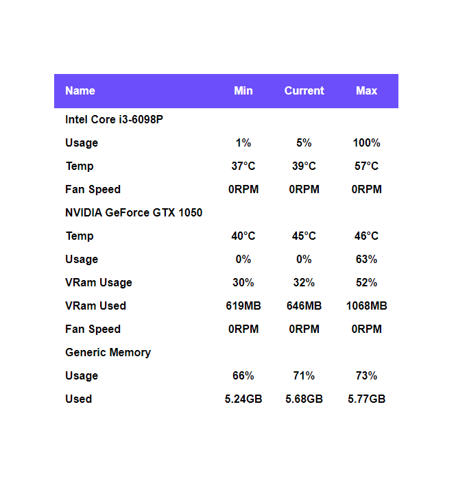

## Mobros Legacy Boilerplate theme

You will able to know how to use this template and create theme as like you want.
By default it provides basic table where all the basic hardware data represented. But you can change the html, css, js to make theme as you want.

#### src/script.js

You will able to found some blank functions which will fire after specific data change from the server.
You can process the data and use it as like as you want.

##### Template also provide high level apis for easier theme implementation.

There is one Object called Hardware. Next I will tell more about Hardware Obj.

Hardware >>
Hardware obj provides basic data for theme customizers.

### Hardware.get(element)

This function helps to Get the Hardware value like temperature, usage.

### Hardware.set(element, refVal, valueVal)

This function helps to Set value of DOM and obj by separate value.

### Hardware.update(element, value)

This function helps to Set and update the Hardware value into obj as well as in HTML DOM by single value.

### Elements in Hardware

#### CPU

| Name                    | Element Obj                          | Type             |
| ----------------------- | ------------------------------------ | ---------------- |
| CPU Name                | `'Hardware.CPU.name'`                | 'String'         |
| CPU Temperature Unit    | `'Hardware.CPU.temperature.unit'`    | 'String' °C / °F |
| CPU Temperature Min     | `'Hardware.CPU.temperature.min'`     | 'Number'         |
| CPU Temperature Current | `'Hardware.CPU.temperature.current'` | 'Number'         |
| CPU Temperature Max     | `'Hardware.CPU.temperature.max'`     | 'Number'         |
| CPU Usage Unit          | `'Hardware.CPU.usage.unit'`          | 'String' %       |
| CPU Usage Min           | `'Hardware.CPU.usage.min'`           | 'Number'         |
| CPU Usage Current       | `'Hardware.CPU.usage.current'`       | 'Number'         |
| CPU Usage Max           | `'Hardware.CPU.usage.max'`           | 'Number'         |
| CPU Fan Unit            | `'Hardware.CPU.fan.unit'`            | 'String' RPM     |
| CPU Fan Min             | `'Hardware.CPU.fan.min'`             | 'Number'         |
| CPU Fan Current         | `'Hardware.CPU.fan.current'`         | 'Number'         |
| CPU Fan Max             | `'Hardware.CPU.fan.max'`             | 'Number'         |

#### GPU

| Name                    | Element Obj                          | Type             |
| ----------------------- | ------------------------------------ | ---------------- |
| GPU Name                | `'Hardware.GPU.name'`                | 'String'         |
| GPU Temperature Unit    | `'Hardware.GPU.temperature.unit'`    | 'String' °C / °F |
| GPU Temperature Min     | `'Hardware.GPU.temperature.min'`     | 'Number'         |
| GPU Temperature Current | `'Hardware.GPU.temperature.current'` | 'Number'         |
| GPU Temperature Max     | `'Hardware.GPU.temperature.max'`     | 'Number'         |
| GPU Usage Unit          | `'Hardware.GPU.usage.unit'`          | 'String' %       |
| GPU Usage Min           | `'Hardware.GPU.usage.min'`           | 'Number'         |
| GPU Usage Current       | `'Hardware.GPU.usage.current'`       | 'Number'         |
| GPU Usage Max           | `'Hardware.GPU.usage.max'`           | 'Number'         |
| GPU Fan Unit            | `'Hardware.GPU.fan.unit'`            | 'String' RPM     |
| GPU Fan Min             | `'Hardware.GPU.fan.min'`             | 'Number'         |
| GPU Fan Current         | `'Hardware.GPU.fan.current'`         | 'Number'         |
| GPU Fan Max             | `'Hardware.GPU.fan.max'`             | 'Number'         |
| GPU VRAM Usage Unit     | `'Hardware.GPU.vram.usage.unit'`     | 'String' %       |
| GPU VRAM Usage Min      | `'Hardware.GPU.vram.usage.min'`      | 'Number'         |
| GPU VRAM Usage Current  | `'Hardware.GPU.vram.usage.current'`  | 'Number'         |
| GPU VRAM Usage Max      | `'Hardware.GPU.vram.usage.max'`      | 'Number'         |
| GPU VRAM Used Unit      | `'Hardware.GPU.vram.used.unit'`      | 'String' MB / GB |
| GPU VRAM Used Min       | `'Hardware.GPU.vram.used.min'`       | 'Number'         |
| GPU VRAM Used Current   | `'Hardware.GPU.vram.used.current'`   | 'Number'         |
| GPU VRAM Used Max       | `'Hardware.GPU.vram.used.max'`       | 'Number'         |

#### Memory

| Name                 | Element Obj                       | Type             |
| -------------------- | --------------------------------- | ---------------- |
| Memory Name          | `'Hardware.Memory.name'`          | 'String'         |
| Memory Usage Unit    | `'Hardware.Memory.usage.unit'`    | 'String' %       |
| Memory Usage Min     | `'Hardware.Memory.usage.min'`     | 'Number'         |
| Memory Usage Current | `'Hardware.Memory.usage.current'` | 'Number'         |
| Memory Usage Max     | `'Hardware.Memory.usage.max'`     | 'Number'         |
| Memory Used Unit     | `'Hardware.Memory.used.unit'`     | 'String' MB / GB |
| Memory Used Min      | `'Hardware.Memory.used.min'`      | 'Number'         |
| Memory Used Current  | `'Hardware.Memory.used.current'`  | 'Number'         |
| Memory Used Max      | `'Hardware.Memory.used.max'`      | 'Number'         |

### Example of getting hardware data

```js
function onCPU_Usage() {
  // Using Hardware.get()
  const usage = Hardware.get(Hardware.CPU.usage.current);

  // Directly
  const usage = Hardware.CPU.usage.current.value;

  // Change Theme state here
}
```

## How to Build Theme ?

### Requirements

1. Basic JavaScript knowledge.
2. HTML & CSS
3. NPM

### Building Steps

Clone the repo first.

> git clone {reponame}

After that goto root of the folder and type this on terminal

> npm install

Then type

> npm run build

Done :)

### How to test theme ?

Create a folder with name (that will be your theme name) on

> C:\Users\\[UserName]\AppData\Local\MoBro_Local\public\theme\\[Here]

Put dist folder and theme-config.json into that folder.
Now goto your MobroApp you will able to see the theme.

**Note:** You can even clone the repo into that theme folder and rapidly build and test for faster development.

### Mobros : [Github](https://github.com/ModBros) [Website](https://www.mod-bros.com/)
